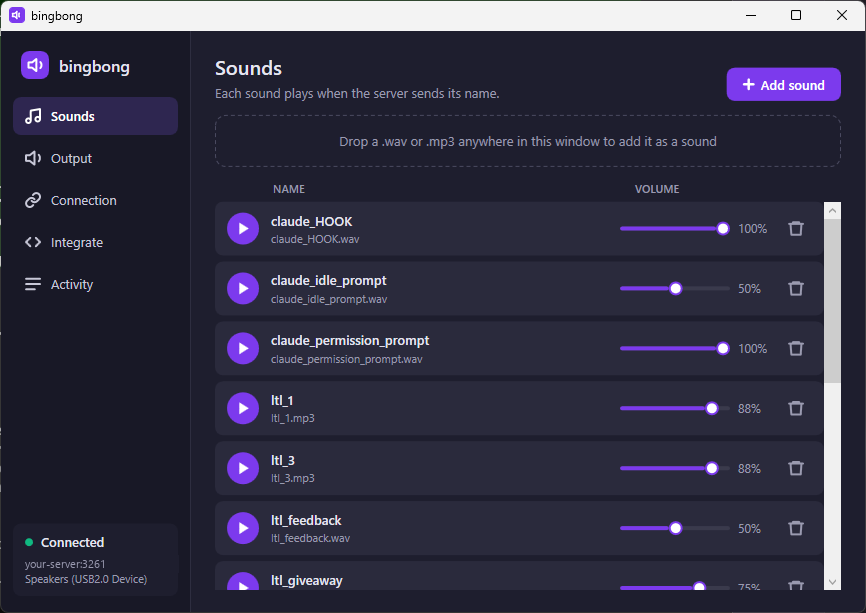

# bingbong

**A noise maker for your first app.**

You built something. Someone out there just signed up, bought a thing, or said hello. bingbong makes a sound come out of a speaker in your house the moment it happens, so you *hear* your app getting used instead of refreshing a dashboard.


Think of the bell on a shop door. Every time a customer walks in, it rings. This is that bell, for software.

## What life looks like with bingbong

- You're making dinner. **Bing bong.** Someone just signed up.
- You're on the couch. **Cha-ching.** An order came in.
- You're in a meeting and hear a quiet *ding* from the office. Someone sent a message through your contact form.
- Different sounds for different things, so you know what happened without looking.

It runs quietly in the Windows system tray, reconnects on its own, and plays on whichever speaker you choose, so it can live on a cheap USB speaker in the kitchen while your headphones stay free.

## How it works, in one picture

```
your app  ──HTTP──▶  bingbong server  ──WebSocket──▶  bingbong on your PC  ──▶  🔊 your speaker
        "someone used it"        "Play order_bell"                  order_bell.wav
```

Your app hits a URL. A tiny relay server tells every connected bingbong to play a sound by name. That's the whole thing.



## Set it up (about 10 minutes)

### 1. Get the Windows app

Download **`bingbong.exe`** from the [latest release](https://github.com/keysforthewin/bingbong/releases/latest) and run it. Nothing to install: it's a single file. It starts hidden in the system tray. Double-click the purple speaker icon to open it.

(If Windows SmartScreen asks, choose "More info" then "Run anyway". The exe isn't code-signed.)

### 2. Run the relay server

The server is a small Node.js program. You can run it on the same PC to try things out, or on any machine your app can reach (a cheap VPS, a Raspberry Pi, Railway, Fly.io, etc.).

```bash
cd server
cp .env.example .env     # sets HTTP_PORT=3260, WS_PORT=3261, PIN=1234
npm install
npm start
```

Or with Docker:

```bash
cd server
docker-compose up --build -d
```

The PIN in `.env` stops random people from connecting their own bingbong to your server. Change it to something of your own.

### 3. Connect the app

In bingbong, open the **Connection** page:

- **WebSocket URL:** `ws://localhost:3261` if the server is on the same PC, or `ws://your-server-address:3261`
- **PIN:** the PIN from your `.env`
- Click **Connect**. The dot in the sidebar turns green.
- Tick **Launch bingbong at startup** so it's always there.

### 4. Add a sound

Open the **Sounds** page and drop any `.wav` or `.mp3` onto the window (or click **Add sound**). The file's name becomes the sound's name. `order_bell.wav` becomes a sound called `order_bell`. Each sound has its own volume slider and a play button to preview it.

### 5. Pick a speaker

On the **Output** page choose the device you want the noise to come out of. bingbong remembers it by name, so it keeps working after reboots and unplugging.

### 6. Make a noise

From any terminal:

```bash
curl http://localhost:3260/bingbong/order_bell
```

If you heard it, you're done. Everything else is just deciding *when* to call that URL.

## Make your app trigger it

Anything that can make a web request can ring the bell. There's no body, no auth, no JSON to build. Just hit the URL with the sound's name at the end:

```
http://your-server:3260/bingbong/order_bell
```

The **Integrate** page inside the app has these snippets pre-filled with your own server address, each with a Copy button:

- the trigger URL (paste it into a Shopify, Stripe, Zapier, or any other webhook field)
- a `curl` line for testing
- one line of Node.js: `await fetch('http://your-server:3260/bingbong/order_bell');`
- a Node.js script that listens like the desktop app does, if you want to build your own listener

### Let your coding agent do it

If you built your app with Claude Code, Cursor, Copilot, or similar, paste this in:

```
Add a "bingbong" notification to this app. Whenever one of these events happens,
make a fire-and-forget HTTP GET request (any method works) to
http://YOUR-SERVER:3260/bingbong/<sound-name> and never let it slow down or break
the main flow (wrap it in try/catch, don't await it in the request path, ignore
failures):

- a new user signs up      -> sound name: new_signup
- an order is completed    -> sound name: new_order
- the contact form is sent -> sound name: new_message

Put the server base URL in an environment variable called BINGBONG_URL and skip
the request entirely when it isn't set. Show me the diff.
```

Replace `YOUR-SERVER` and the event list with your own. Then add sounds called `new_signup`, `new_order`, and `new_message` in the app.

## Sharing it

There's a 15-second promo cut for X / Twitter (16:9, 1080p, with sound) at [`docs/bingbong-promo.mp4`](docs/bingbong-promo.mp4). The GIF at the top of this page is the same clip without audio.

## Updates

bingbong checks GitHub for new releases every few hours. When there's a newer version it downloads it, swaps itself out, and restarts, all in the background. You can turn this off on the **Connection** page (Updates section) or press **Check now** to update immediately.

New releases are published by pushing a version tag: `git tag v1.2.0 && git push --tags`. A GitHub Action builds the single-file exe and attaches it to the release.

## Common questions

**Do I have to leave the app open?**
It lives in the system tray. Closing the window just hides it. Use the tray icon's Exit to actually quit.

**Can I have it on more than one computer?**
Yes. Every bingbong connected to the same server plays the sound. Each one can use different sound files and speakers.

**Does it work on Mac or Linux?**
The desktop app is Windows only (.NET 8, WPF). The server runs anywhere Node.js runs.

**Is it safe to put the server on the internet?**
The PIN keeps strangers from connecting a listener. The trigger URL itself is open by design (webhook services need to reach it). Worst case, someone plays your sounds. If that bothers you, put the server behind a reverse proxy with HTTPS and an allow-list.

**What sound formats work?**
WAV, MP3, AIFF, WMA, and OGG.

## For developers

- Client (C# / WPF): [`client/README.md`](client/README.md)
- Server (Node.js): [`server/server.js`](server/server.js), about 60 lines
- The client accepts three message formats over WebSocket: `Play <name>`, a bare `<name>`, or JSON like `{"sound": "<name>"}`
- Config lives in `%APPDATA%\bingbong\config.json`; sound files in `%APPDATA%\bingbong\sounds\`
